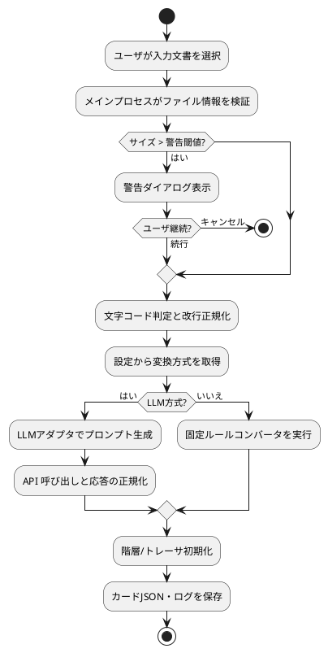
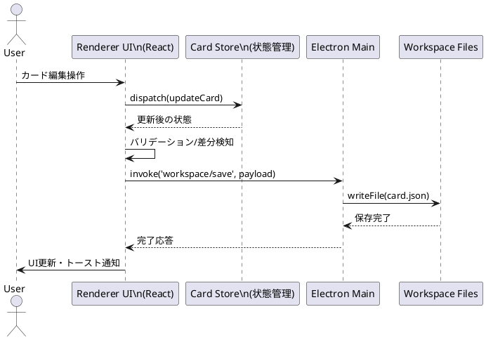
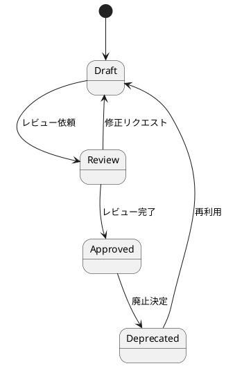

# mdsplitter 詳細設計

最終更新日: 2025-11-02  
対象リポジトリ: `mdsplitter_copy_codex`

## 1. システム概要
- 目的: 自然言語ドキュメントをカード単位に構造化し、階層・トレーサビリティを含む編集を可能にする Electron/React/TypeScript 製デスクトップアプリ。
- 現状コード: Electron メインプロセス/プリロード (`src/main/`)、Vite ベースのレンダラースケルトン (`src/renderer/`)、IPC ハンドシェイク (`app:ping`) とステータス表示 UI を含む骨格を実装。既存サンプル (`Hello`/`sum`) も残存。
- 運用前提: Node.js 22.20.0、npm 10.8.0 以上。`npm run dev` は Vite ウォッチ + TypeScript ウォッチ + Electron の 3 並列で動作する。WSL2 では Electron が GUI 非対応のため、Windows/macOS/Linux GUI 環境での起動確認が必要 (WSL2 ではビルド・テストのみ実行可能)。

## 2. フォルダ・ファイル構成
凡例: ✅=実装済み / ⚠️=テンプレート・スタブのみ / ⛔=未作成

### 2.1 ルートディレクトリと主要フォルダ
| パス | 役割 | 備考 | 状況 |
| --- | --- | --- | --- |
| `src/` | アプリケーション本体 | `main/` (Electron) と `renderer/` (React) に分割。 | ⚠️ |
| `src/main/` | Electron メイン/プリロード | ブラウザウィンドウ生成と IPC スタブを実装。 | ⚠️ |
| `src/renderer/` | Vite + React レンダラー | Skeleton UI と `window.app` 経由のハンドシェイク確認を実装。 | ⚠️ |
| `tests/` | Playwright E2E テスト | `tests/e2e/smoke.spec.ts` で最小限の smoke テスト。 | ⚠️ |
| `test-results/` | Jest/Playwright 実行結果 | `.last-run.json` に最新実行情報を保存。 | ⚠️ |
| `spec/` | 要求・UI 仕様書 | `SW要求仕様書.md`、`UI設計書.md` が要件源泉。 | ✅ |
| `doc/` | ドキュメント類 | `操作ガイド.md` (操作ガイド骨子) と本ファイル。 | ⚠️ |
| `task/` | タスク計画 | `task_all.md` にフェーズ別 WBS。 | ✅ |
| `journal/` | 作業ログ | 日次記録 (`journal_YYYYMMDD.txt`) を格納。 | ✅ |
| `node_modules/` | npm 依存パッケージ | `package-lock.json` 管理。 | ✅ |

### 2.2 設定ファイルと補助スクリプト
| ファイル | 位置 | 概要 | 状況 |
| --- | --- | --- | --- |
| `package.json` | ルート | アプリ情報、依存関係、npm スクリプト定義。`npm run dev`=Viteウォッチ+tscウォッチ+Electron起動、`npm run build`=Vite→tsc。 | ⚠️ |
| `package-lock.json` | ルート | npm 依存バージョン固定。 | ✅ |
| `tsconfig.json` | ルート | TypeScript 設定。`@/*` エイリアス。`noEmit`。 | ✅ (設定) |
| `tsconfig.main.json` | ルート | Electron メイン/プリロードのトランスパイル設定 (`dist/main` 出力)。 | ⚠️ |
| `jest.config.cjs` | ルート | Jest 設定。`ts-jest` プリセット/`jsdom`。 | ✅ (設定) |
| `jest.setup.ts` | ルート | Jest DOM カスタムマッチャ導入 (`@testing-library/jest-dom`)。 | ✅ |
| `playwright.config.ts` | ルート | Playwright 設定。Chromium プロジェクト (WSL2 では `--no-sandbox` 相当の対応が必要)。 | ✅ |
| `vite.config.ts` | ルート | Vite 設定。`src/renderer` をルートに `dist/renderer` へ出力し、`base: './'` で Electron の `file://` 読み込みでもアセット解決可能にしている。 | ⚠️ |
| `.eslintrc.cjs` | ルート | ESLint ルール。React/TypeScript/Testing Library/Import プラグイン。 | ✅ |
| `.eslintignore` | ルート | Lint 対象外定義 (`node_modules` 等)。 | ✅ |
| `CONTRIBUTING.md` | ルート | 開発フロー・コミットガイドライン。 | ⚠️ (骨子) |
| `AGENT.md`, `CLAUDE.md` | ルート | AI エージェント運用メモ。 | ⚠️ |

### 2.3 ソースコード構成
| パス | 主な内容 | メモ | 状況 |
| --- | --- | --- | --- |
| `src/main/main.ts` | BrowserWindow 生成、設定/ワークスペース初期化、IPC ハンドラ登録。 | WSL2 では Electron 自体が GUI 動作不可、GUI ホストで確認する。 | ⚠️ |
| `src/main/preload.ts` | `window.app` API を公開する contextBridge。 | 設定読み書き・ログ出力・ping を公開。 | ⚠️ |
| `src/main/logger.ts` | ログレベル制御とファイルローテーションを担当するロガー。 | `settings.json` の logging セクションを参照し出力。 | ⚠️ |
| `src/main/workspace.ts` | ワークスペースディレクトリ生成と設定ファイル管理。 | `_input/_out/_logs` 作成とサンプルファイル配置、設定既定値を提供。 | ⚠️ |
| `src/main.ts` | レンダラエントリ移行後の互換プレースホルダ。 | 旧インポート経路維持のみを目的とした空モジュール。 | ⚠️ |
| `src/renderer/main.tsx` | React エントリポイント。`App` を `#root` にマウント。 | Vite ビルド対象。 | ⚠️ |
| `src/renderer/store/workspaceStore.ts` | 分割パネルごとのタブ/カードを管理する Zustand ストア。 | パネル⇔タブ⇔カードのマッピング、ファイル排他 (同一ファイルの多重オープン禁止)、カード更新・ステータス循環・保存フラグ更新を実装。 | ⚠️ |
| `src/renderer/store/uiStore.ts` | テーマ設定ストア。ライト/ダークモードのトグルを提供。 | Tailwind ダークモード制御に利用。 | ⚠️ |
| `src/renderer/store/notificationStore.ts` | 共通通知(トースト)の状態管理。 | レベル別のメッセージ表示と自動消去を担当。 | ⚠️ |
| `src/renderer/App.tsx` | レイアウト骨格 (メニュー/ツールバー/サイドバー/カード/ログ/ステータス) と IPC ステータスログ、リサイズ制御を実装。 | コンパクトモードでの余白調整とテーマ切替を保持。 | ⚠️ |
| `src/renderer/styles.css` | Tailwind 基礎スタイルと `@apply` によるコンポーネントスタイル。ライト/ダークテーマに対応。 | 文字サイズ・余白を小さくしたコンパクトデザインを適用。 | ⚠️ |
| `src/vite-env.d.ts` | Vite クライアント型補完の参照ディレクティブ。 | 実装コードは含まず型補助のみ提供。 | ✅ |
| `src/components/Hello.tsx` | 挨拶コンポーネント。プロパティ `name` を受け取り、`role="status"` の段落で表示。 | テスト: `src/components/Hello.test.tsx`。日本語挨拶の確認のみ。 | ✅ (サンプル) |
| `src/utils/sum.ts` | 純粋関数 `sum(a, b)` を提供。 | テスト: `src/utils/sum.test.ts`。 | ✅ (サンプル) |
| `src/sum.ts` | ルート直下のサンプル `sum` 関数。 | テスト: `src/sum.test.ts` が正整数と負数の正常系を検証。 | ✅ (サンプル) |
| (未実装) | メインレイアウト/状態管理/ファイル I/O 等の本機能コード | `task/task_all.md` のフェーズ 1 以降で実装予定。 | ⛔ |

#### 2.3.1 コネクタ描画関連コンポーネント（計画）
| パス | 主な内容 | 備考 | 状況 |
| --- | --- | --- | --- |
| `src/renderer/components/TraceConnectorLayer.tsx` | 隣接する左右パネル間のコネクタを SVG で描画するレイヤ。 | SVG `<path>` ベース、パネルごとの仮想化・インタラクション対応。 | ⛔ |
| `src/renderer/store/connectorLayoutStore.ts` | カード要素の位置情報と可視状態を保持するストア。 | ResizeObserver/MutationObserver を用いて DOM 位置をトラッキング。 | ⛔ |
| `src/renderer/hooks/useConnectorLayout.ts` | カードコンポーネントから位置情報を登録/更新するフック。 | `CardPanel` 内のカード要素に適用し、アンカー座標を測定。 | ⛔ |
| `src/shared/traceability.ts` | コネクタ定義（方向・種類・スタイル）の共通型。 | 後続フェーズでメイン/レンダラ間共有。 | ⛔ |

## 3. ユースケース一覧
全ユースケースは仕様段階であり、現行コードには未実装。ステータスを明示する。

| UC ID | ユースケース | 概要 | 主要アクター | 成功条件 | 実装状況 |
| --- | --- | --- | --- | --- | --- |
| UC-01 | ワークスペース初期化 | `_input/`, `_out/`, `_logs/`, `settings.json` を生成し既定設定をロード。 | ユーザ、設定管理モジュール | 必要フォルダ/ファイル生成と UI 反映。 | ⚠️ |
| UC-02 | 文書取り込み | `.md`/`.txt` の文字コード判定・サイズチェック後にコピー。 | ユーザ、ファイル I/O モジュール | `_input/` 配下に保存し読み込み成功。 | ⛔ |
| UC-03 | カード変換（固定ルール） | 共通ルールで文書をカード化し JSON へ保存。 | ユーザ、カード変換モジュール | `_out/` にカード JSON 保存、ログ出力。 | ⛔ |
| UC-04 | カード変換（LLM） | LLM アダプタで分割し監査情報と共に保存。 | ユーザ、LLM アダプタ | JSON 保存、監査ログ出力。 | ⛔ |
| UC-05 | カード編集 | カード CRUD、ステータス操作、Undo/Redo。 | ユーザ、カード編集 UI | ストアとファイル整合、未保存状態表示。 | ⛔ |
| UC-06 | トレーサビリティ管理 | カード間リンク追加/削除と可視化。 | ユーザ、トレーサ管理モジュール | `trace_*.json` 更新、ビュー反映。 | ⛔ |
| UC-07 | 検索・フィルタ | 種別/ステータス/テキストで絞り込み。 | ユーザ、検索モジュール | 条件一致カード表示と親展開。 | ⛔ |
| UC-08 | 設定変更と即時反映 | `settings.json` や UI からの設定変更を即時反映。 | ユーザ、設定モジュール | バリデーション通過と変更反映ログ。 | ⚠️ |
| UC-09 | ログ監査 | 操作ログ収集とローテーション。 | ユーザ、ログモジュール | ログが閾値管理され監査要件満足。 | ⛔ |

## 4. 処理フロー (PlantUML)
以下のダイアグラムは要求仕様ベースの将来設計であり、現行コードには対応処理が存在しない。

### 4.1 カード変換アクティビティ図


### 4.2 カード編集シーケンス図


### 4.3 カード状態遷移図


## 5. ライブラリ利用状況

### 5.1 本番依存
| ライブラリ | 用途 | 主な利用箇所 | 実装状況 |
| --- | --- | --- | --- |
| `react` | UI コンポーネントフレームワーク | `src/renderer/App.tsx`、`src/components/Hello.tsx`。 | ⚠️ |
| `react-dom` | React レンダラー | `src/renderer/main.tsx` で `App` をマウント。 | ⚠️ |
| `zustand` | グローバル状態管理（Zustand） | `src/renderer/store/workspaceStore.ts`、`src/renderer/App.tsx`。 | ⚠️ |
| `tailwindcss` | ユーティリティファースト CSS フレームワーク | `src/renderer/styles.css`、`tailwind.config.js`。 | ⚠️ |
| `postcss` | Tailwind ビルドチェーン | `postcss.config.js`。 | ⚠️ |
| `autoprefixer` | CSS プレフィックス自動付与 | `postcss.config.js`。 | ⚠️ |

### 5.2 開発・テスト依存
| カテゴリ | ライブラリ | 用途 | 実装状況 |
| --- | --- | --- | --- |
| 型/言語 | `typescript`, `ts-node`, `ts-jest` | TypeScript 利用、Electron/テスト連携。 | ⚠️ (設定のみ) |
| 単体テスト | `jest`, `@types/jest`, `jest-environment-jsdom` | フロントエンドテスト基盤。 | ⚠️ (sum/Hello/Skeleton) |
| コンポーネントテスト | `@testing-library/react`, `@testing-library/jest-dom`, `@testing-library/user-event` | UI 振る舞い検証。 | ⚠️ (サンプルのみ) |
| E2E テスト | `@playwright/test`, `wait-on`, `cross-env` | Chromium ベースの自動テスト。WSL2 は `--no-sandbox` 前提。 | ⚠️ (Smoke のみ) |
| Lint/整形 | `eslint`, `@typescript-eslint/*`, `eslint-plugin-react`, `eslint-plugin-react-hooks`, `eslint-plugin-testing-library`, `eslint-plugin-jest-dom`, `eslint-plugin-import`, `eslint-config-prettier`, `prettier` | コード品質管理。 | ✅ (設定活用可) |
| デスクトップ | `electron` | メイン/レンダラープロセス構築。 | ⚠️ (Skeleton 実装) |
| ビルド/実行補助 | `vite`, `@vitejs/plugin-react`, `concurrently` | レンダラービルドと並列実行管理。 | ⚠️ |

### 5.3 エンジン・ツール前提
- Node.js: 22.20.0 (必須エンジンとして `package.json` に明示)。
- npm: 10.8.0 以上。
- PlantUML: 本ドキュメントの図式表現用 (サーバー/CLI いずれかで描画想定、生成プロセス未構築)。

### 5.4 ワークスペーススナップショット
- 保存先: `_out/workspace.snapshot.json` (`WORKSPACE_SNAPSHOT_FILENAME`)。
- フォーマット:

```json
{
  "cards": [
    {
      "id": "card-001",
      "title": "プロジェクト概要",
      "body": "…",
      "status": "approved",
      "kind": "heading",
      "hasLeftTrace": true,
      "hasRightTrace": true,
      "updatedAt": "2025-11-03T09:15:00.000Z"
    }
  ],
  "savedAt": "2025-11-03T09:15:05.000Z"
}
```

- バリデーション: `src/shared/workspace.ts:1-73` の `isWorkspaceSnapshot` が id/title/body 等の必須フィールドをチェック。
- I/O: `src/main/main.ts:82-133` が `workspace:save` / `workspace:load` IPC を提供し、`src/main/workspace.ts:19-168` で JSON を読み書きする。
- レンダラー: `src/renderer/App.tsx:146-466` が初回マウント時に `workspace.load` を呼び出してストアへハイドレートし、保存完了後も `Ctrl+S` で同ファイルを更新する。

## 6. 実装進捗と今後の観点
- フェーズ P1-03: UI 設計書に沿ったレイアウト骨格（メニュー/ツールバー/サイドバー/カードパネル/ログ/ステータスバー）をプレースホルダで構築し、サイドバー幅とログエリア高さのドラッグリサイズを実装済み。次工程ではグローバルストア連携と実データ描画を進める。
- フェーズ P1-04: Zustand ストアを導入し、カードダミーデータの表示とステータス更新アクションを UI へ接続。ストアの単体テストおよび App コンポーネントの振る舞いテストを追加済み。次フェーズでは実データソースへの接続やストア分割を検討する。
- フェーズ P1-05: Tailwind CSS を導入し、`App` 全体を `@apply` ベースのユーティリティスタイルに刷新。テーマ設定ストアを新設し、ライト/ダークモード切替が UI 全域に反映される基盤とテストを整備。以降は実データ/コンポーネント化時に Tailwind の抽象化を進める。
- フェーズ P2-01: `settings.json` の読み書き API を実装し、テーマ設定を IPC 経由で同期。設定読込/保存結果をログへ記録する処理を追加。
- フェーズ P2-02: `app.getPath('userData')` 配下に `_input/_out/_logs` を自動生成し、サンプル入出力ファイルと初期ログを配置するワークスペース初期化を実装。
- フェーズ P2-03: ファイルロガーを実装し、ログレベル設定とサイズローテーションに対応。レンダラからのログ送信 API を整備し、設定変更時にロガーへ反映するよう調整。
- フェーズ P2-04: 共通通知コンポーネントと Zustand ストアを実装し、テーマ設定やエラーハンドリングで再利用。Tailwind スタイルでトースト表示を整備し、自動消去と手動閉じを提供。
- フェーズ P2-05: `src/renderer/App.tsx` で保存 (`Ctrl+S`)、上下/左右分割 (`Ctrl+Shift+\\` / `Ctrl+\\`)、検索 (`Ctrl+F`) のショートカットマッピングを実装。`src/shared/workspace.ts` にカードモデル/スナップショット共通型・バリデーション (`isWorkspaceSnapshot`/`CARD_KIND_VALUES`) を定義し、`src/main/preload.ts`・`src/main/main.ts`・`src/main/workspace.ts` で `workspace:save/load` IPC を通じて `_out/workspace.snapshot.json` を読み書きする。読み込み時にカード内容を検証し、無効カードがあれば除外してトースト通知・ログ出力を行う。ステータスバーと `split-grid` レイアウト (`styles.css`) に保存状態と分割モードを反映し、`src/renderer/App.test.tsx` でショートカット操作と保存・バリデーションの UI テストを追加。
- フェーズ P2-09a/b: `src/renderer/store/workspaceStore.ts` をタブ指向設計へ刷新し、葉ノード毎にタブ配列・アクティブタブ・カード一覧・未保存フラグを保持。`openTab/closeTab/closeLeaf` でカードファイルをタブ化し、同一ファイルの複数パネル展開を禁止 (`fileToLeaf` マップ) する。`src/renderer/CardPanel.tsx` はタブバー/タブ閉じボタン/空表示メッセージを描画し、`App.tsx` はタブ状態を利用して保存・ステータス更新・ファイル読み込みをアクティブパネル単位で処理する。`styles.css` にタブ用クラス (`tab-bar__tab-container` 等) を追加し、`workspaceStore.test.ts` と `App.test.tsx` でタブ管理・重複禁止のユニット/統合テストを整備。
- P1-05 追加対応: 文字サイズと余白を見直し、全 UI をコンパクト表示（text-sm 基準、ツールバー/ステータスバー高さ縮小、ログエリア 112px）へ調整。
- `npm run dev` は GUI 対応 OS 上で実行してウィンドウ起動を確認する。WSL2 では `electron` が GUI を持たず、メインプロセス API (`ipcMain`) が未定義となるためテスト/ビルドのみ実施し、GUI 検証は Windows/macOS/Linux ホストで行う。
- ファイル I/O、カード変換、トレーサ管理などのコア機能はすべて未実装。仕様は `spec/SW要求仕様書.md` 章 2〜7、`spec/UI設計書.md` を参照し詳細設計へ落とし込む。
- テスト基盤は Jest/Playwright の設定が存在するが、網羅的なテストケースは未作成。機能実装に伴いユニット・統合・E2E テストを拡充する。
- ドキュメント更新は仕様変更と連動させる必要があり、本ファイルも実装進捗に合わせてステータスを更新すること。


## 8. トレーサビリティコネクタ設計方針
本節では P2-10 以降で実装予定のコネクタ描画基盤について、技術選定書（`spec/traceability_connector_tech_decision.md`）を踏まえた具体的な構成を整理する。

### 8.1 採用方針概要
- **描画方式**: SVG `<path>` を用いたベクタ描画。Canvas へ切り替える判断基準は 1,000 本超のコネクタで FPS < 24 が継続した場合とする。
- **レンダリングレイヤ**: `TraceConnectorLayer` をパネル領域最上位に重ね、左右に隣接するスプリットペア単位で SVG を生成する。
- **データ取得**: Zustand ベースの `connectorLayoutStore` にカード要素のアンカー座標と可視領域をキャッシュし、スクロール/リサイズ時は requestAnimationFrame でバッチ更新する。
- **スタブデータ**: P2-11 まではローカルスタブ (`traceability.stubs.ts`) を使用し、将来的にメインプロセスのトレーサビリティ API と連携する。

### 8.2 コンポーネント構成
1. `TraceConnectorLayer`
   - `SplitContainer` の下層に配置し、対象の左右ペアを検出。
   - ペアごとに `<svg>` 要素を生成し、可視カード間の Connector パスを描画。
2. `ConnectorPath`
   - 1 本のコネクタを担当する純粋コンポーネント。
   - 曲線制御点は `bezierControlPoints(from, to)` で算出、種別に応じたクラス名を付与。
3. `useConnectorLayout`
   - `CardPanel` 内の `article.card` 要素に `data-card-id` を付与して DOMRect を測定。
   - ResizeObserver/MutationObserver で変化を捕捉し、store へ反映。
4. `connectorLayoutStore`
   - `cards: Record<CardId, AnchorRect>`、`panels: Record<LeafId, PanelRect>` を保持。
   - `updateCardAnchor`, `removeCard`, `setPanelScroll` などのアクションを提供。

### 8.3 フェーズ別タスク細分化案
- **P2-10a**: `TraceConnectorLayer` の土台を実装し、左右ペア判定と SVG コンテナの表示を行う。ダミー座標を用いた単一コネクタ描画でレンダリング経路を検証する。
- **P2-10b**: `useConnectorLayout`/`connectorLayoutStore` を導入し、カード DOM からアンカー座標を収集。スクロール・リサイズに追従するよう更新処理を整備する。
- **P2-10c**: スタブトレースデータとカード ID を紐付け、左右パネル双方で存在するカードのみコネクタ化。方向性・種別に応じたスタイル付与、ハイライト状態の受け口を設置。
- **P2-11**: コネクタ描画の統合テスト（React Testing Library + DOMRect モック）と Storybook/Playwright 用のスタブシナリオを追加し、負荷検証の取っ掛かりを用意。
- **先行検討 (P2-12 以降)**: カード折畳みとの連動、トグル表示、ホバー/選択インタラクション、ライン編集 UI を順次追加。

### 8.4 将来拡張ポイント
- コネクタ本数が閾値を超えた場合、SVG 内で `visibility` 切替と仮想化を行う。
- トレーサビリティ編集機能（ドラッグ、新規作成）は専用 Interaction Layer を追加し、命令はストア経由でメインプロセスと同期する。
- WebGL / Canvas へのスイッチを想定し、コネクタ描画ロジックはアダプタパターンで分離する。
