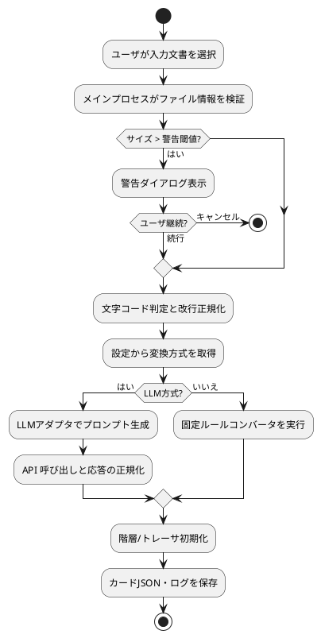
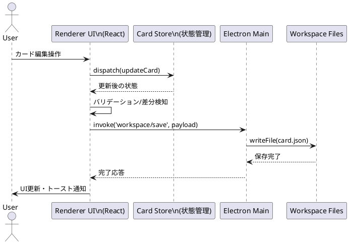
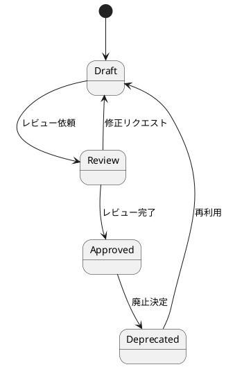

# mdsplitter 詳細設計

最終更新日: 2025-11-02  
対象リポジトリ: `mdsplitter_copy_codex`

## 1. システム概要
- 目的: 自然言語ドキュメントをカード単位に構造化し、階層・トレーサビリティを含む編集を可能にする Electron/React/TypeScript 製デスクトップアプリ (現状は仕様ベースで未実装)。
- 現状コード: UI サンプル (`src/components/Hello.tsx`) とユーティリティ (`src/utils/sum.ts`) を中心に、テスト・Lint・E2E 基盤が整備されたテンプレート段階。その他のアプリ機能は未着手。
- 運用前提: Node.js 22.6.0、npm 10.8.0 以上。Jest/Playwright によるテスト、ESLint/Prettier による品質管理を想定 (ツール設定は存在するがアプリ本体に紐づく実装は未完成)。

## 2. フォルダ・ファイル構成
凡例: ✅=実装済み / ⚠️=テンプレート・スタブのみ / ⛔=未作成

### 2.1 ルートディレクトリと主要フォルダ
| パス | 役割 | 備考 | 状況 |
| --- | --- | --- | --- |
| `src/` | アプリケーション本体 (React/TypeScript) | `components/` と `utils/` にサンプルのみ。 | ⚠️ |
| `tests/` | Playwright E2E テスト | `tests/e2e/smoke.spec.ts` で最小限の smoke テスト。 | ⚠️ |
| `test-results/` | Jest/Playwright 実行結果 | `.last-run.json` に最新実行情報を保存。 | ⚠️ |
| `spec/` | 要求・UI 仕様書 | `SW要求仕様書.md`、`UI設計書.md` が要件源泉。 | ✅ |
| `doc/` | ドキュメント類 | `操作ガイド.md` (操作ガイド骨子) と本ファイル。 | ⚠️ |
| `task/` | タスク計画 | `task_all.md` にフェーズ別 WBS。 | ✅ |
| `journal/` | 作業ログ | 日次記録 (`journal_YYYYMMDD.txt`) を格納。 | ✅ |
| `node_modules/` | npm 依存パッケージ | `package-lock.json` 管理。 | ✅ |

### 2.2 設定ファイルと補助スクリプト
| ファイル | 位置 | 概要 | 状況 |
| --- | --- | --- | --- |
| `package.json` | ルート | アプリ情報、依存関係、npm スクリプト定義。`start`/`build`/`electron` は TODO プレースホルダ。 | ⚠️ |
| `package-lock.json` | ルート | npm 依存バージョン固定。 | ✅ |
| `tsconfig.json` | ルート | TypeScript 設定。`@/*` エイリアス。`noEmit`。 | ✅ (設定) |
| `jest.config.cjs` | ルート | Jest 設定。`ts-jest` プリセット/`jsdom`。 | ✅ (設定) |
| `jest.setup.ts` | ルート | Jest DOM カスタムマッチャ導入 (`@testing-library/jest-dom`)。 | ✅ |
| `playwright.config.ts` | ルート | Playwright 設定。Chromium プロジェクト、ヘッドレス実行。 | ✅ |
| `.eslintrc.cjs` | ルート | ESLint ルール。React/TypeScript/Testing Library/Import プラグイン。 | ✅ |
| `.eslintignore` | ルート | Lint 対象外定義 (`node_modules` 等)。 | ✅ |
| `CONTRIBUTING.md` | ルート | 開発フロー・コミットガイドライン。 | ⚠️ (骨子) |
| `AGENT.md`, `CLAUDE.md` | ルート | AI エージェント運用メモ。 | ⚠️ |

### 2.3 ソースコード構成
| パス | 主な内容 | メモ | 状況 |
| --- | --- | --- | --- |
| `src/components/Hello.tsx` | 挨拶コンポーネント。プロパティ `name` を受け取り、`role="status"` の段落で表示。 | テスト: `src/components/Hello.test.tsx`。日本語挨拶の確認のみ。 | ✅ (サンプル) |
| `src/utils/sum.ts` | 純粋関数 `sum(a, b)` を提供。 | テスト: `src/utils/sum.test.ts`。 | ✅ (サンプル) |
| (未実装) | メインレイアウト/状態管理/ファイル I/O 等の本機能コード | `task/task_all.md` のフェーズ 1 以降で実装予定。 | ⛔ |

## 3. ユースケース一覧
全ユースケースは仕様段階であり、現行コードには未実装。ステータスを明示する。

| UC ID | ユースケース | 概要 | 主要アクター | 成功条件 | 実装状況 |
| --- | --- | --- | --- | --- | --- |
| UC-01 | ワークスペース初期化 | `_input/`, `_out/`, `_logs/`, `settings.json` を生成し既定設定をロード。 | ユーザ、設定管理モジュール | 必要フォルダ/ファイル生成と UI 反映。 | ⛔ |
| UC-02 | 文書取り込み | `.md`/`.txt` の文字コード判定・サイズチェック後にコピー。 | ユーザ、ファイル I/O モジュール | `_input/` 配下に保存し読み込み成功。 | ⛔ |
| UC-03 | カード変換（固定ルール） | 共通ルールで文書をカード化し JSON へ保存。 | ユーザ、カード変換モジュール | `_out/` にカード JSON 保存、ログ出力。 | ⛔ |
| UC-04 | カード変換（LLM） | LLM アダプタで分割し監査情報と共に保存。 | ユーザ、LLM アダプタ | JSON 保存、監査ログ出力。 | ⛔ |
| UC-05 | カード編集 | カード CRUD、ステータス操作、Undo/Redo。 | ユーザ、カード編集 UI | ストアとファイル整合、未保存状態表示。 | ⛔ |
| UC-06 | トレーサビリティ管理 | カード間リンク追加/削除と可視化。 | ユーザ、トレーサ管理モジュール | `trace_*.json` 更新、ビュー反映。 | ⛔ |
| UC-07 | 検索・フィルタ | 種別/ステータス/テキストで絞り込み。 | ユーザ、検索モジュール | 条件一致カード表示と親展開。 | ⛔ |
| UC-08 | 設定変更と即時反映 | `settings.json` や UI からの設定変更を即時反映。 | ユーザ、設定モジュール | バリデーション通過と変更反映ログ。 | ⛔ |
| UC-09 | ログ監査 | 操作ログ収集とローテーション。 | ユーザ、ログモジュール | ログが閾値管理され監査要件満足。 | ⛔ |

## 4. 処理フロー (PlantUML)
以下のダイアグラムは要求仕様ベースの将来設計であり、現行コードには対応処理が存在しない。

### 4.1 カード変換アクティビティ図

### 4.2 カード編集シーケンス図

### 4.3 カード状態遷移図

## 5. ライブラリ利用状況

### 5.1 本番依存
| ライブラリ | 用途 | 主な利用箇所 | 実装状況 |
| --- | --- | --- | --- |
| `react` | UI コンポーネントフレームワーク | `src/components/Hello.tsx` のみ。 | ⚠️ |
| `react-dom` | React レンダラー | Electron レンダラープロセスで使用予定。 | ⛔ |

### 5.2 開発・テスト依存
| カテゴリ | ライブラリ | 用途 | 実装状況 |
| --- | --- | --- | --- |
| 型/言語 | `typescript`, `ts-jest` | TypeScript 利用と Jest 連携。 | ⚠️ (設定のみ) |
| 単体テスト | `jest`, `@types/jest`, `jest-environment-jsdom` | フロントエンドテスト基盤。 | ⚠️ (sum/Hello のみ) |
| コンポーネントテスト | `@testing-library/react`, `@testing-library/jest-dom`, `@testing-library/user-event` | UI 振る舞い検証。 | ⚠️ (サンプルのみ) |
| E2E テスト | `@playwright/test` | Chromium ベースの自動テスト。 | ⚠️ (Smoke のみ) |
| Lint/整形 | `eslint`, `@typescript-eslint/*`, `eslint-plugin-react`, `eslint-plugin-react-hooks`, `eslint-plugin-testing-library`, `eslint-plugin-jest-dom`, `eslint-plugin-import`, `eslint-config-prettier`, `prettier` | コード品質管理。 | ✅ (設定活用可) |
| デスクトップ | `electron` | メイン/レンダラープロセス構築。 | ⛔ |

### 5.3 エンジン・ツール前提
- Node.js: 22.6.0 (必須エンジンとして `package.json` に明示)。
- npm: 10.8.0 以上。
- PlantUML: 本ドキュメントの図式表現用 (サーバー/CLI いずれかで描画想定、生成プロセス未構築)。

## 6. 実装進捗と今後の観点
- UI 実装はサンプルコンポーネント段階 (`Hello` のみ)。`task/task_all.md` のフェーズ 1 以降に従ってレイアウト構築・状態管理を実装する必要がある。
- ファイル I/O、カード変換、トレーサ管理などのコア機能はすべて未実装。仕様は `spec/SW要求仕様書.md` 章 2〜7、`spec/UI設計書.md` を参照し詳細設計へ落とし込む。
- テスト基盤は Jest/Playwright の設定が存在するが、網羅的なテストケースは未作成。機能実装に伴いユニット・統合・E2E テストを拡充する。
- ドキュメント更新は仕様変更と連動させる必要があり、本ファイルも実装進捗に合わせてステータスを更新すること。
